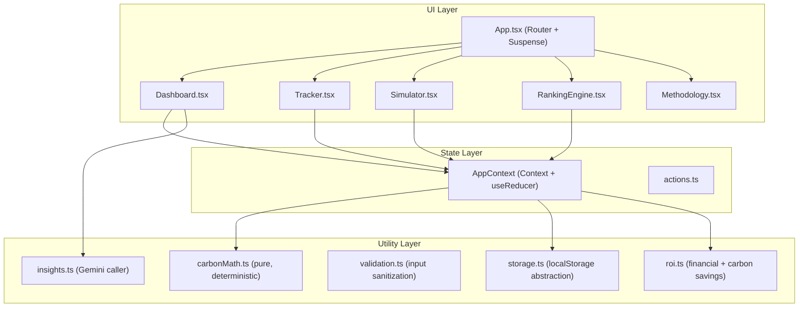

# 🌿 Carbon Future Simulator

Carbon Future Simulator is a production-quality, zero-backend, offline-first progressive web app designed to bridge the gap between daily lifestyle habits, carbon emissions, and long-term financial costs.

## 🚀 Key Features

1. **Eco Dashboard:** A responsive display of your monthly footprint, carbon score ring, category comparative progress bars, and recent activity logger.
2. **AI Carbon Advisor:** Incorporates a Gemini AI advisor (utilizing raw fetches, no external SDKs) delivering personalized and encouraging suggestions. Falls back to a robust deterministic advisor when offline.
3. **Twin Simulation Projections:** Slide-control parameters dynamically driving a 12-month dual-line AreaChart (Recharts) modeling your current vs improved environmental footprint.
4. **Analog Persona Card:** Translates cumulative CO₂ and cash savings into relatable analogies (e.g. flight equivalents, tree absorption metrics).
5. **Prioritized Action Engine:** Sorted suggestions computed using a customized impact formula that weighs carbon reduction, financial returns, and difficulty.
6. **Transparent Methodology:** Fully open UN/EPA constants and normalized scoring equations published on the Methodology tab.

---

## 🛠️ Architecture



---

## ⚡ Setup & Development

### Installation

Install dependencies using npm:

```bash
npm install --legacy-peer-deps
```

### Run Dev Server

Start the Vite development server locally:

```bash
npm run dev
```

### Testing

Run the full Vitest unit and integration test suite:

```bash
npm run test
```
