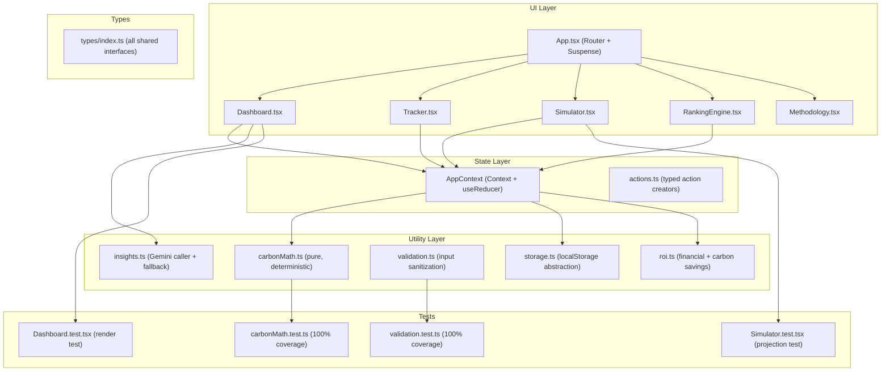

# 🌿 Carbon Future Simulator — Implementation Plan

> **Status:** Planning Only — No code created yet.
> **Headline:** "See your carbon future before you live it."
> **Execution can begin any time after review.**

---

## 1. Problem Statement

Most people have no intuitive sense of how their daily habits translate into carbon emissions or long-term financial costs. Existing carbon calculators are one-shot forms with no longitudinal tracking, no financial ROI framing, and no simulation of alternative futures. Carbon Future Simulator bridges this gap as a zero-backend, offline-first, production-quality progressive web app.

---

## 2. Tech Stack Decision Matrix

| Concern | Choice | Rationale |
|---|---|---|
| UI Framework | React 19 | Concurrent features, `useOptimistic`, Server Components-ready architecture |
| Language | TypeScript (Strict) | Zero `any` — enforced via `tsconfig.json` |
| Styling | Tailwind CSS v3 | Utility-first, purged in build, zero runtime CSS-in-JS overhead |
| Charts | Recharts | Lightweight, composable, React-native |
| Icons | Lucide React | Tree-shakeable, accessible by default |
| Build Tool | Vite 5 | Sub-second HMR, static output, offline-ready |
| Testing | Vitest + React Testing Library | Native ESM, fast, co-located with Vite |
| State | React Context + `useReducer` | No external deps, offline-first, serializable state |
| Persistence | Custom `storage.ts` abstraction | Wraps `localStorage`, fails gracefully |
| AI (Optional) | Gemini API (fetch, no SDK) | Fails safely to deterministic text |

---

## 3. Architecture Overview



---

## 4. Folder Structure

```
/home/sudeep/dev/projects/p3/
├── .gitignore
├── README.md
├── features.txt
├── tech.txt
├── prompts.txt
├── project-constraints.md
├── package.json
├── vite.config.ts
├── tsconfig.json               ← strict mode
├── tailwind.config.ts
├── index.html
└── src/
    ├── main.tsx
    ├── App.tsx                 ← routing, lazy loading, Suspense
    ├── types/
    │   └── index.ts            ← ALL shared TypeScript interfaces
    ├── context/
    │   ├── AppContext.tsx
    │   └── actions.ts
    ├── utils/
    │   ├── carbonMath.ts       ← deterministic coefficients + score
    │   ├── storage.ts          ← localStorage abstraction
    │   ├── validation.ts       ← input sanitization + guards
    │   ├── roi.ts              ← financial + carbon ROI engine
    │   └── insights.ts         ← Gemini caller + offline fallback
    ├── hooks/
    │   ├── useCarbon.ts        ← computed footprint from context
    │   └── useStorage.ts       ← typed load/save hooks
    ├── components/
    │   ├── Dashboard.tsx       ← totals, score, trend, breakdown
    │   ├── Tracker.tsx         ← multi-step activity input
    │   ├── Simulator.tsx       ← twin projections + timeline
    │   ├── RankingEngine.tsx   ← ranked recommendations + ROI
    │   ├── Methodology.tsx     ← data transparency section
    │   └── shared/
    │       ├── ScoreRing.tsx
    │       ├── TrendChart.tsx
    │       ├── CategoryBar.tsx
    │       └── PersonaCard.tsx
    └── tests/
        ├── carbonMath.test.ts
        ├── validation.test.ts
        ├── Dashboard.test.tsx
        └── Simulator.test.tsx
```

---

## 5. Core Data Models (`types/index.ts`)

```ts
// Activity entry (single log item)
interface ActivityEntry {
  id: string;
  timestamp: number;
  category: 'transport' | 'food' | 'electricity' | 'shopping';
  subcategory: string;
  quantity: number;
  unit: string;
  kgCO2: number;
}

// Aggregated user state
interface UserFootprint {
  entries: ActivityEntry[];
  monthlyTarget: number; // kg CO2
}

// Simulator lifestyle levers
interface SimulatorState {
  transportMode: TransportMode;
  weeklyKm: number;
  diet: DietType;
  monthlyKwh: number;
  monthlyClothingItems: number;
  monthlyElectronicsItems: number;
}

// Recommendation from RankingEngine
interface Recommendation {
  id: string;
  title: string;
  description: string;
  monthlyCarbonSavingKg: number;
  monthlyFinancialSavingUSD: number;
  difficultyPenalty: number;  // 1–10
  impactScore: number;        // computed
  explanation: string;        // "Why #1" toggle content
}

// Score breakdown
interface CarbonScore {
  total: number;        // 0–100 (lower = better)
  transportPct: number;
  foodPct: number;
  electricityPct: number;
  shoppingPct: number;
}
```

---

## 6. Calculation Engine (`carbonMath.ts`)

### Coefficients (deterministic, exposed in UI)

| Category | Subcategory | Coefficient |
|---|---|---|
| Transport | Car | 0.192 kg/km |
| Transport | Bus | 0.089 kg/km |
| Transport | Train | 0.041 kg/km |
| Transport | Flight | 0.255 kg/km |
| Transport | Walk/Bike | 0.000 kg/km |
| Food | High Meat | 7.2 kg/day |
| Food | Mixed | 5.6 kg/day |
| Food | Vegetarian | 3.8 kg/day |
| Food | Vegan | 2.9 kg/day |
| Electricity | Grid | 0.385 kg/kWh |
| Shopping | Clothing | 15 kg/item |
| Shopping | Electronics | 80 kg/item |

### Carbon Score Formula

```
Score = 100 - (
  (transportScore × 0.35) +
  (foodScore × 0.25) +
  (electricityScore × 0.20) +
  (shoppingScore × 0.20)
)
```

Where each category score is normalized against a global average baseline (to be documented in `Methodology.tsx`).

---

## 7. ROI Engine (`roi.ts`)

### Financial Cost Coefficients

| Lever | Embedded Cost Saving |
|---|---|
| Car → Train | $0.08/km saved |
| Car → Bus | $0.06/km saved |
| High Meat → Vegan diet | $2.10/day saved |
| High Meat → Vegetarian | $1.40/day saved |
| 10% electricity reduction | $0.12/kWh saved |
| 1 less clothing purchase | $45 saved/item |
| 1 less electronics purchase | $180 saved/item |

### Impact Score

```
impactScore = (monthlyCarbonSavingKg × 1.5) + (monthlyFinancialSavingUSD × 0.5) - (difficultyPenalty × 10)
```

Rankings are sorted descending by `impactScore`.

---

## 8. Storage Abstraction (`storage.ts`)

```ts
// API surface (implementation wraps localStorage with try/catch)
function save<T>(key: StorageKey, value: T): void
function load<T>(key: StorageKey, fallback: T): T
function update<T>(key: StorageKey, updater: (prev: T) => T, fallback: T): void
function remove(key: StorageKey): void
```

- All keys are typed via a `StorageKey` enum — no magic strings in components.
- All operations are wrapped in `try/catch` — storage quota errors silently log and return fallback.
- No component ever imports `localStorage` directly.

---

## 9. AI Insights (`insights.ts`)

### Flow

```
1. Check window.navigator.onLine
2. Check for VITE_GEMINI_API_KEY env variable
3. If both OK → call Gemini API with structured prompt
4. If fetch fails OR offline → return deterministic fallback string
5. Never throw — always returns a string
```

### Prompt Template

```
"The user's highest emission category is [CATEGORY] at [PCT]% of their total footprint ([KG] kg/month).
Give one specific, actionable recommendation with exact numbers for reducing this. 
Keep it under 40 words. Be encouraging."
```

---

## 10. Simulator (Flagship Feature)

### State

- **Current Path:** Extrapolation of `UserFootprint` entries over 12 months (no change).
- **Improved Path:** Real-time sliders for each lever; instantly recalculated via `carbonMath.ts`.

### Milestones Timeline (Recharts `AreaChart`)

- X-axis: Month 0, 3, 6, 9, 12
- Y-axis: Cumulative kg CO2 saved (left), $ saved (right, secondary)
- Two area series: "Current Path" (red/amber) vs "Improved Path" (green)

### Future Persona Card

```
"Future You (Dec 2026)"
Saved 748 kg CO₂ — equivalent to 3 long-haul flights
Saved $412 in reduced food and transport costs
Top Change: Switched 30km/week from car to train
Carbon Score: 67 → 82 (+15 points)
```

---

## 11. Tracker (Multi-Step Form)

### Steps

1. **Transport** — mode selector (radio), weekly km (number input with validation)
2. **Food** — diet type selector (radio), days tracked (default: 1)
3. **Electricity** — monthly kWh (number input), optional: solar offset toggle
4. **Shopping** — clothing items (stepper), electronics items (stepper)
5. **Review & Save** — shows per-category kgCO2, confirm button

### Validation Rules

- All numeric inputs: reject `< 0`, `NaN`, `Infinity`
- Weekly km: max 2000 (beyond is unrealistic for a single person)
- Monthly kWh: max 5000
- Inline error messages below each input (no alert dialogs)

---

## 12. Accessibility Strategy

| Requirement | Implementation |
|---|---|
| Every input has a `<label>` | Enforced in Tracker multi-step |
| ARIA labels on icon-only buttons | `aria-label` on all Lucide icon buttons |
| Keyboard navigation | Tab order follows visual flow; no focus traps |
| Focus-visible states | Tailwind `focus-visible:ring-2` on all interactive elements |
| Color contrast | All text at minimum 4.5:1 ratio (WCAG AA) |
| Semantic HTML | `<main>`, `<nav>`, `<section>`, `<article>`, `<header>` used correctly |
| Chart alt text | Recharts wrapped with `role="img"` + `aria-label` summaries |
| Skip link | `<a href="#main-content">Skip to content</a>` as first DOM element |

---

## 13. Testing Strategy

### `carbonMath.test.ts` (100% coverage target)

- Coefficient accuracy: all 11 coefficients tested with exact values
- Score formula: transport/food/electricity/shopping weighted correctly
- Edge cases: zero input, max realistic input, negative input rejection

### `validation.test.ts` (100% coverage target)

- Negative numbers rejected
- NaN rejected
- Numbers above domain max rejected
- Valid edge values (0, boundary values) accepted

### `Dashboard.test.tsx`

- Renders without crashing with empty state
- Renders correctly with mock `ActivityEntry[]` data
- AI insight fallback renders when offline

### `Simulator.test.tsx`

- "Current Path" projection is flat-extrapolation of current entries
- "Improved Path" decreases monotonically as levers are adjusted
- Future Persona Card updates with slider changes

---

## 14. Documentation Files

| File | Contents |
|---|---|
| `README.md` | Problem, Solution, Mermaid diagram, Setup, A11y strategy, Data Methodology |
| `features.txt` | Flat list of all implemented features |
| `tech.txt` | Tech stack + version pinning rationale |
| `prompts.txt` | AI prompt templates used in `insights.ts` |
| `project-constraints.md` | Anti-feature-creep rules, no-auth constraint, size limit, offline-first mandate |

---

## 15. Phased Execution Plan

> All phases are sequential. Each phase is a discrete PR-equivalent checkpoint.

### Phase 0 — Project Bootstrap (Est. ~30 min)
- [ ] `npm create vite@latest . -- --template react-ts`
- [ ] Install: `tailwindcss`, `recharts`, `lucide-react`, `vitest`, `@testing-library/react`
- [ ] Configure: `tsconfig.json` (strict), `tailwind.config.ts`, `vite.config.ts` (vitest)
- [ ] Create folder structure, `.gitignore`, all 5 doc files

### Phase 1 — Core Utilities (Est. ~45 min)
- [ ] `types/index.ts` — all interfaces
- [ ] `utils/carbonMath.ts` — coefficients + score formula (pure functions)
- [ ] `utils/validation.ts` — input guards
- [ ] `utils/storage.ts` — localStorage abstraction
- [ ] `utils/roi.ts` — financial + impact score
- [ ] `utils/insights.ts` — Gemini caller + fallback
- [ ] **Tests:** `carbonMath.test.ts` + `validation.test.ts` → all passing, 100% coverage

### Phase 2 — State Layer (Est. ~20 min)
- [ ] `context/AppContext.tsx` — `useReducer` + provider
- [ ] `context/actions.ts` — typed action creators
- [ ] `hooks/useCarbon.ts` — computed values hook
- [ ] `hooks/useStorage.ts` — typed persistence hook

### Phase 3 — Tracker (Est. ~45 min)
- [ ] Multi-step form with full A11y
- [ ] Per-step validation with inline error messages
- [ ] Auto-persist via `storage.ts` on step completion
- [ ] Review & Save screen with carbon preview

### Phase 4 — Dashboard (Est. ~45 min)
- [ ] Score ring, total footprint, monthly trend (`TrendChart`)
- [ ] Category breakdown (`Recharts PieChart` / `BarChart`)
- [ ] AI insight panel (with graceful offline fallback)
- [ ] **Test:** `Dashboard.test.tsx`

### Phase 5 — Simulator (Est. ~60 min)
- [ ] Dual-path `AreaChart` (Current vs. Improved)
- [ ] Lifestyle sliders with instant recalculation
- [ ] Milestone timeline (Month 0→12)
- [ ] Future Persona Card
- [ ] **Test:** `Simulator.test.tsx`

### Phase 6 — Ranking Engine (Est. ~30 min)
- [ ] Sorted recommendation list with impact scores
- [ ] "Why #1" toggle with exact math explainer
- [ ] Financial + carbon savings per recommendation

### Phase 7 — Methodology & Polish (Est. ~30 min)
- [ ] `Methodology.tsx` — coefficient table, score formula, data sources
- [ ] `React.lazy` + `Suspense` for chart-heavy components
- [ ] Global `focus-visible`, skip link, ARIA audit
- [ ] Final `README.md` with Mermaid diagram

### Phase 8 — Final Validation (Est. ~20 min)
- [ ] `npm run test -- --coverage` → 100% on target files, zero warnings
- [ ] Manual Lighthouse run → A11y ≥ 95, Perf ≥ 90
- [ ] Repo size check → `du -sh dist/` < 10MB
- [ ] Offline test: disable network, verify full functionality

---

## 16. Key Constraints Checklist

> [!IMPORTANT]
> These are hard rules — not to be relaxed during execution.

- [ ] Zero `any` types in TypeScript
- [ ] No direct `localStorage` in any component
- [ ] No auth, no cloud sync, no backend
- [ ] No spinner for deterministic calculations
- [ ] Gemini API must fail silently (never crash the UI)
- [ ] All inputs validated before touching state
- [ ] Repository size < 10MB after build
- [ ] `dangerouslySetInnerHTML` never used

---

## 17. Open Questions / Decisions Needed

> [!NOTE]
> These can be decided before execution begins.

1. **Target currency:** Financial savings currently assumed in USD. Should this be configurable (USD/INR/EUR)?
2. **Baseline for Carbon Score normalization:** Global average adult footprint (~4.7 tonnes/year) will be used. Confirm?
3. **Gemini API key delivery:** Will the key be set as a Vite env variable (`VITE_GEMINI_API_KEY`) in a local `.env` file?
4. **Color theme:** Dark mode only, light mode only, or toggle? (Affects design system in Phase 0.)
5. **Routing:** Single-page with tab navigation, or multi-route (`/dashboard`, `/tracker`, `/simulator`)? Multi-route is more accessible and SEO-friendly.
6. **Deployment target:** GitHub Pages, Vercel, Netlify? (Affects `vite.config.ts` `base` path.)
